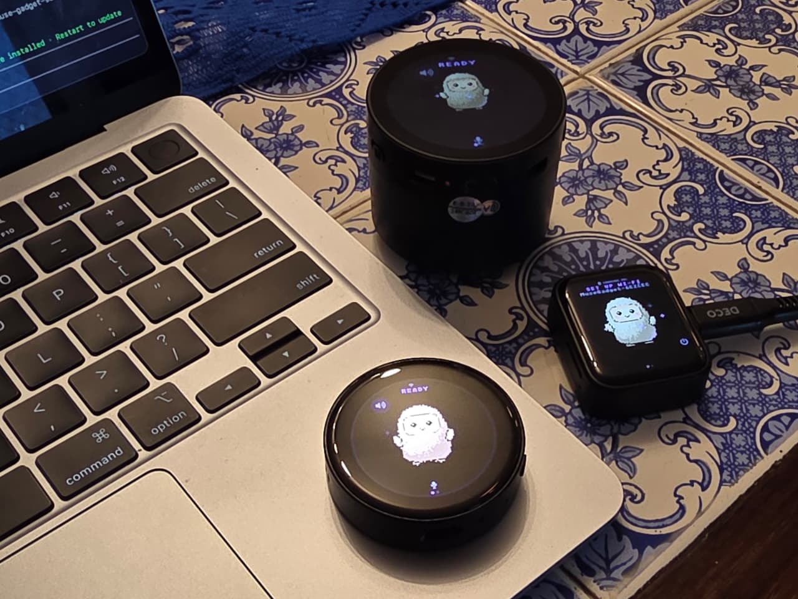
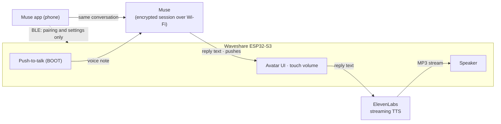
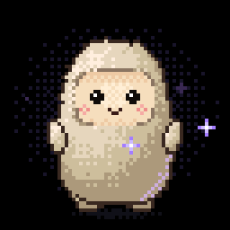
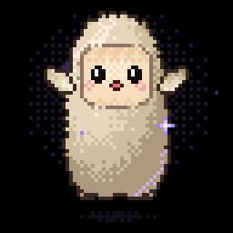

# Waveshare × Muse Gadgets

**Meta's [Muse Gadget SDK](https://github.com/facebookincubator/muse-gadget-sdk), running on three round and square Waveshare ESP32-S3 boards — and talking back out loud.**

<p align="center">
  
  <br>
  <sub>Muse on all three: the <b>LCD 1.85C</b> in its speaker enclosure (back), the round <b>AMOLED 1.43C</b> (front) and the <b>AMOLED 1.8</b> waiting for Wi-Fi (right).</sub>
</p>

This is a fork of `facebookincubator/muse-gadget-sdk` that adds three Waveshare boards to the ESP32 Device SDK, plus a few features the upstream firmware doesn't have yet: spoken replies, replies you didn't ask for (pushes), touch volume and battery level on boards without a power chip.

| | Waveshare ESP32-S3-Touch-LCD-1.85C | Waveshare ESP32-S3-Touch-AMOLED-1.43C | Waveshare ESP32-S3-Touch-AMOLED-1.8 |
|---|---|---|---|
| Screen | 1.85" round LCD, 360×360, ST77916 (QSPI) | 1.43" round AMOLED, 466×466, SH8601 (QSPI) | 1.8" AMOLED, 368×448, SH8601 or CO5300 (QSPI) |
| Touch | CST816 | FocalTech-style @ 0x15 | FT3168 or CST816 |
| Audio | ES8311 + amp, ES7210 dual mic | ES8311 + NS4150B, ES7210 dual mic | ES8311 (speaker and mic) |
| Power | No PMU · battery by ADC | No PMU · battery by ADC + charge pin | AXP2101 |
| Flash / PSRAM | 16 MB / 8 MB octal | 8 MB / 8 MB octal (PICO-1-N8R8) | 16 MB / 8 MB octal |
| Talk button | BOOT | BOOT | BOOT (PWR is aux) |
| Alias | `s185c` | `s143c` | `s18` |

All three run the **full Muse UI**: animated avatar, push-to-talk, touch settings, images from Muse, the home-network tunnel and OTA. They are community ports and **experimental**.

## What's new compared to upstream

The short version is below; [`docs/CHANGES-FROM-UPSTREAM.md`](docs/CHANGES-FROM-UPSTREAM.md) has every change, why, and its default.

| Feature | What it does | Where |
|---|---|---|
| 🗣️ **Spoken replies** | Every reply is read aloud through the speaker with [ElevenLabs](https://elevenlabs.io) streaming TTS, captions following the speech. Audio starts ~1 s after the text arrives. Without a key, replies stay text. | `components/muse/muse_chat_session.cpp` (`start_tts`, `tts_fetch`), `Kconfig` |
| 📬 **All messages** | Optional, **off by default** (Settings › All messages). When on, Muse messages that arrive with no question pending — Muse writing first, or replying to something you typed in the app in the same conversation — wake the screen and are shown and spoken, and the session stays connected so they keep arriving. Off saves battery. | `muse_chat_session.cpp` (`push_begin`), `muse_voice.c` (`play_push`) |
| 🔊 **Touch volume** | Drag up or down on the avatar screen to change the volume; a cyan ring on the edge shows the level and fades after 2 s. Horizontal swipes still open settings. | `components/muse/muse_ui.c` (`volume_drag`) |
| 🔋 **Battery** | Settings › Battery shows just the **percentage** and an estimate of the **time left** at the current drain. The 1.85C and 1.43C read it through the ADC (they have no power chip). | `boards/board_waveshare_s3_185c.c`, `boards/board_waveshare_s3_143c.c` |
| 🧊 **Display freeze fix** | Cherry-picked from upstream [PR #34](https://github.com/facebookincubator/muse-gadget-sdk/pull/34): LVGL could starve the band sender and freeze the screen after ~20 min. | `boards/muse_lcd_bands.c` |
| 🐕 **Watchdogs** | Turned back on for these boards: a stuck task panics with a backtrace and reboots instead of leaving the board dead until RST. | `devices/sdkconfig.muse-waveshare-s3-*` |
| 😵 **Avatar reactions** | Shake Muse and it gets dizzy (boards with a QMI8658 accelerometer, found by probing). Before the screen goes dark Muse drowses for 4 s with a quiet snore, and it wakes up when the screen comes back on. Jollybot draws all three (see [New avatar reactions](#new-avatar-reactions)). | `components/muse/muse_imu.c`, `muse_input.c` (`check_sleep`, `check_shake`), `muse_voice.c` (`play_snore`) |
| 🤭 **Tickle** | Rub Muse's face quickly back and forth, or tap it four times fast, and Muse giggles for as long as you keep going, then catches its breath. Taps, the volume drag and the swipe to settings work as before. Jollybot draws it (see [New avatar reactions](#new-avatar-reactions)). | `components/muse/muse_ui.c` (`touch_read`, `tickle_poll`), `muse_state.c` |
| 🔐 **Secrets outside git** | The SDK token and API keys live in `secrets/` (gitignored) and are injected into each build's generated `sdkconfig`. | `secrets/`, `tools/muse/secrets.py` |



## New avatar reactions

Muse now reacts to the world a little, like a toy that gets dizzy when you shake it.

> 💡 These ideas — getting dizzy, dozing off with a snore, waking up, and now giggling when tickled — came from watching my 8-year-old son **Bernardo** play with Jollybot and Muse. Thanks, Bernardo!


<table>
  <tr>
    <td align="center"><br><b>Dizzy</b><br><sub>Shake the board</sub></td>
    <td align="center"><br><b>Sleepy</b><br><sub>Right before the screen goes dark (with a soft snore)</sub></td>
    <td align="center"><br><b>Waking</b><br><sub>When the screen comes back on</sub></td>
    <td align="center"><br><b>Tickled</b><br><sub>Rub his face quickly, or tap fast</sub></td>
  </tr>
</table>

- **Dizzy** needs the QMI8658 accelerometer. The firmware probes for it at boot: the AMOLED 1.8 has one, and the log says whether the others do. Three quick back-and-forth swings count as a shake; a tap or picking it up doesn't.
- **Sleepy** plays for the last 4 s before auto-sleep; touching or pressing anything cancels it. Two quiet snores play if Speaker is on.
- **Waking** plays for 1.5 s every time the screen turns on.
- **Tickled**: rub his face quickly back and forth, or tap it four times fast. He giggles for as long as you keep going, then catches his breath. A single tap still gives hearts.

The timing, the sensor and the snore are part of the firmware (Apache 2.0). The drawing is in Jollybot itself — please read the note below.

### About the Jollybot avatar

Jollybot (`esp32/avatar/`) is **Meta's character** and is **not** covered by the Apache License, as Meta's own README states. This fork adds complementary animations to it: dizzy, sleepy, waking and tickled, plus the previews above. **These animations and images are not covered by the Apache License either**; they share the character's status. We claim no rights to Jollybot or to these additions and charge nothing for them. They're a fan contribution, and we'll remove them at Meta's request: [wupsbr@gmail.com](mailto:wupsbr@gmail.com). With the reactions idle, Jollybot renders exactly as Meta made him.

## Quick start

You need a Mac or Linux machine, a **USB-C cable that carries data** (charge-only cables are a common trap), one of the boards, a [Muse SDK token](https://gadgets.muse.ai/settings/sdk-tokens) and the Muse app.

**1. Install ESP-IDF v6.0.1** (the only version the SDK supports):

```sh
brew install cmake ninja dfu-util python3          # macOS
git clone -b v6.0.1 --recursive https://github.com/espressif/esp-idf.git ~/esp/esp-idf-v6
~/esp/esp-idf-v6/install.sh esp32s3
```

**2. Add your secrets** (see [`secrets/README.md`](secrets/README.md)):

```sh
git clone https://github.com/wupsbr/waveshare-muse-gadget-sdk && cd waveshare-muse-gadget-sdk
cp secrets/muse_sdk_token.example secrets/muse_sdk_token            # paste your mgst_… token
cp secrets/elevenlabs_api_key.example secrets/elevenlabs_api_key    # optional: spoken replies
chmod 600 secrets/*
```

**3. Build and flash** (`s185c`, `s143c` or `s18`):

```sh
cd esp32
tools/muse/board.sh build s185c
tools/muse/board.sh flash s185c
```

`board.sh` finds ESP-IDF on its own, copies the secrets into `build-muse-<board>/sdkconfig` and prints only which ones it set. For a clean first install, erase the board first: `python -m esptool -p /dev/cu.usbmodem… erase-flash`.

**4. Pair.** In the Muse app turn on **Settings › Devices › Developer mode**, tap **+**, pick `MuseGadget-XXXXXX` (the name is on the board's screen) and press **BOOT** when the screen asks. Then send it your Wi-Fi from the app.

**5. Talk.** Hold **BOOT**, speak, let go.

## Using Claude Code? Let it do the work

This repo is set up for [Claude Code](https://claude.com/claude-code). [`CLAUDE.md`](CLAUDE.md) gives it the boards, the build and flash flow, how to read logs without resetting the board, the hardware traps and, above all, the rules that keep your token and keys out of chat, logs and git. The **`flash-muse-board`** skill (`.claude/skills/`) does the whole flash: it finds the board, backs it up, identifies the model, builds, flashes and checks the boot log.

```sh
git clone https://github.com/wupsbr/waveshare-muse-gadget-sdk && cd waveshare-muse-gadget-sdk
cp secrets/muse_sdk_token.example secrets/muse_sdk_token    # paste your token yourself, not in the chat
claude
```

Then just ask:

> I plugged in a board. Find out which one it is and flash Muse on it.

> Watch the serial log and tell me when it's ready to pair.

> The screen froze after a while. Find out why.

> Make the replies use my ElevenLabs voice `<voice id>`.

> Add support for my Waveshare ESP32-S3-Touch-AMOLED-2.06.

> What's new upstream since our last sync? Merge what's useful.

Claude asks before anything destructive, like `erase-flash` or overwriting a backup. Flashing needs the USB port, so run Claude outside a sandbox, or allow the esptool commands.

## Hardware notes

Things that cost us time, so they don't cost you:

- **Back up the factory firmware first:** `python -m esptool -p PORT read-flash 0 0x1000000 factory.bin` (`0x800000` on the 8 MB 1.43C). It's the only way back to the vendor demo.
- **Identify the exact model** before flashing: the 1.85**C**, 1.43**C** and 1.8 differ from their non-C siblings. `esptool chip-id` plus `strings factory.bin | grep -i board` usually names it.
- **1.85C side header:** `E5`–`E8` are the TCA9554 expander's pins, not ESP32 GPIOs, and `19`/`20` are the USB data lines — using them as GPIO kills flashing and the console. The header's SDA/SCL are the same internal I2C bus (GPIO 11/10) as touch, RTC, codecs and expander.
- **1.85C buttons:** only BOOT is readable. RST resets the chip and the slide switch disconnects the battery.
- **1.85C panel revisions:** register `0x04` reads `00 02 7f 7f` on the revision that needs Waveshare's long vendor init sequence; the board file checks it.
- **1.43C** is mounted upside down: `MADCTL 0xC0`, and touch is flipped on both axes. PWR drives a hardware power latch, not a GPIO.
- **1.8** comes in two revisions (SH8601 + FT3168, or CO5300 + CST816). The board file probes the touch controller to tell them apart.
- **ElevenLabs over HTTPS** needs `CONFIG_MBEDTLS_CERTIFICATE_BUNDLE_CROSS_SIGNED_VERIFY=y`: `api.elevenlabs.io` sends GTS Root R1 cross-signed by a GlobalSign root that's no longer in ESP-IDF's bundle.
- **USB hubs and docks** can drop the board for minutes, which looks exactly like a firmware hang. Flash and monitor straight from the computer's port.

## Repository layout

```
esp32/                                   Meta's ESP32 Device SDK, plus:
  components/muse/boards/
    board_waveshare_s3_185c.c            1.85C: ST77916, CST816, TCA9554, ES8311/ES7210, ADC battery
    board_waveshare_s3_143c.c            1.43C: SH8601, touch @0x15, ES8311/ES7210, ADC battery
    board_waveshare_s3_18.c              1.8: SH8601/CO5300, FT3168/CST816, AXP2101
  devices/sdkconfig.muse-waveshare-s3-*  board overlays
  tools/muse/secrets.py                  secrets → build sdkconfig
secrets/                                 your token and keys (gitignored)
CLAUDE.md, .claude/skills/               guidance and a flash skill for Claude Code
linux/  skills/                          upstream, unchanged
README.meta.md                           upstream README
```

Each board is also documented the upstream way in [`esp32/devices/README.md`](esp32/devices/README.md) and [`esp32/AGENTS.md`](esp32/AGENTS.md).

## Staying in sync with upstream

```sh
git remote add upstream https://github.com/facebookincubator/muse-gadget-sdk.git
git fetch upstream && git merge upstream/main
```

## Security

- Your **SDK token and ElevenLabs key are compiled into the firmware.** Don't share a `build-*/` directory or a flashed image. If a key leaks, revoke it (gadgets.muse.ai, elevenlabs.io) and rebuild.
- Pairing is community pairing (button press, no manufacturer attestation): pair on a network you trust.
- Consider `CONFIG_HOMEHUB_NVS_ENCRYPTION` so Wi-Fi credentials and device tokens aren't readable from flash.

## Author

**David Ruiz** — [wupsbr@gmail.com](mailto:wupsbr@gmail.com)

Building something with Muse gadgets, or got one of these boards talking? Let's keep in touch: [linkedin.com/in/wupsbr](https://www.linkedin.com/in/wupsbr/). Issues and pull requests are welcome.

## License and credits

Apache License 2.0, like upstream — see [`LICENSE`](LICENSE) and [`NOTICE`](NOTICE). Built on [facebookincubator/muse-gadget-sdk](https://github.com/facebookincubator/muse-gadget-sdk) by Meta. Board details come from Waveshare's examples and schematics; panel and codec drivers from Espressif's component registry. The display-freeze fix is from upstream PR #34 by @toddsherman. Not affiliated with Meta, Waveshare or ElevenLabs.

> Built by hackers, for hackers, just for fun. Flashing custom firmware can brick boards and void warranties. Proceed at your own risk!
